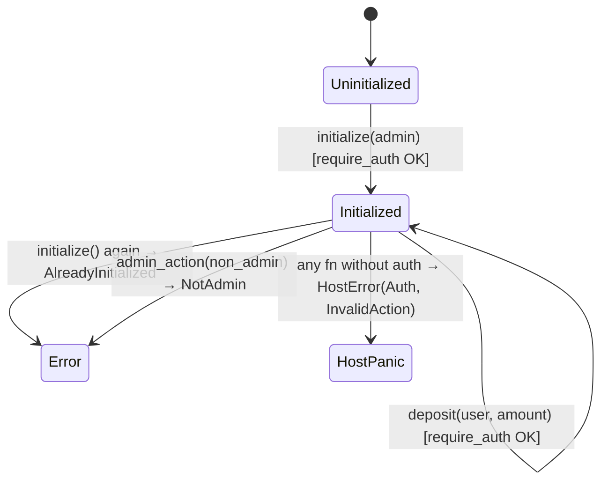
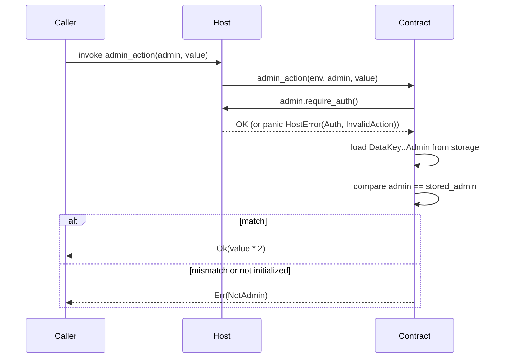

# Design Document: basic-address-auth

## Overview

This example adds `examples/basics/10-basic-address-auth/` to the Soroban Cookbook. It is a minimal, self-contained Soroban smart contract that demonstrates the three foundational address-authentication patterns every Soroban developer needs:

1. Calling `require_auth()` on an `Address` parameter to gate state-mutating functions.
2. Storing an admin role in instance storage and restricting privileged operations to that admin.
3. Returning structured `AuthError` variants for application-level authorization failures, while letting the Soroban host handle host-level auth panics.

The contract is intentionally small — no token balances, no allowances, no events — so the auth patterns are not obscured by unrelated logic. It is the "hello world" of Soroban authorization.

---

## Architecture

The example is a single Soroban contract crate with no external dependencies beyond `soroban-sdk`. There are no sub-crates, no shared libraries, and no cross-contract calls.

```
examples/basics/10-basic-address-auth/
├── Cargo.toml
├── README.md
└── src/
    ├── lib.rs      ← contract definition
    └── test.rs     ← unit + integration tests
```

The contract lifecycle is:



---

## Components and Interfaces

### `DataKey` enum

```rust
#[contracttype]
pub enum DataKey {
    Admin,
    Deposit(Address),
}
```

- `Admin` — stores the privileged `Address` in instance storage.
- `Deposit(Address)` — stores a per-user `u32` deposit amount in instance storage (used by the self-service `deposit` function to demonstrate user-facing auth).

### `AuthError` enum

```rust
#[contracterror]
#[derive(Copy, Clone, Debug, Eq, PartialEq)]
#[repr(u32)]
pub enum AuthError {
    Unauthorized      = 1,
    NotAdmin          = 2,
    AlreadyInitialized = 3,
}
```

Variants map to the three distinct application-level failure modes. The `#[contracterror]` macro makes these serializable as `Error(Contract, #N)` in test panic messages.

### `AuthContract` — public interface

| Function | Signature | Auth pattern | Returns |
|---|---|---|---|
| `initialize` | `(env: Env, admin: Address) -> Result<(), AuthError>` | `admin.require_auth()` | `Err(AlreadyInitialized)` on re-init |
| `get_admin` | `(env: Env) -> Option<Address>` | none (read-only) | `Some(addr)` or `None` |
| `admin_action` | `(env: Env, admin: Address, value: u32) -> Result<u32, AuthError>` | `admin.require_auth()` + admin check | `value * 2` or `Err(NotAdmin)` |
| `deposit` | `(env: Env, user: Address, amount: u32) -> Result<(), AuthError>` | `user.require_auth()` | `Ok(())` |
| `get_deposit` | `(env: Env, user: Address) -> u32` | none (read-only) | stored amount or `0` |

`deposit` / `get_deposit` provide the self-service auth pattern (Requirement 3.3): any user can deposit to their own account, demonstrating that `require_auth()` is not limited to admin roles.

---

## Data Models

### Instance storage layout

| Key | Type | Lifetime | Description |
|---|---|---|---|
| `DataKey::Admin` | `Address` | instance | Set once by `initialize`; never updated |
| `DataKey::Deposit(Address)` | `u32` | instance | Cumulative deposit per user |

Instance storage is used throughout (rather than persistent) because this is a cookbook example focused on auth patterns, not storage TTL management.

### Auth flow for `admin_action`



---

## Correctness Properties

*A property is a characteristic or behavior that should hold true across all valid executions of a system — essentially, a formal statement about what the system should do. Properties serve as the bridge between human-readable specifications and machine-verifiable correctness guarantees.*

### Property 1: Admin storage round-trip

*For any* valid `Address`, calling `initialize` with that address and then calling `get_admin` should return `Some` of that same address.

**Validates: Requirements 1.1, 1.4**

---

### Property 2: Authorization is recorded in env.auths()

*For any* `Address` used to call a `require_auth`-protected function (with `mock_all_auths` active), the resulting `env.auths()` slice should contain an entry whose address matches the caller address.

**Validates: Requirements 2.2, 6.1**

---

### Property 3: Non-admin address is rejected by admin_action

*For any* initialized contract and *for any* `Address` that is not the stored admin, calling `admin_action` with that address (even with `mock_all_auths`) should return `Err(AuthError::NotAdmin)`.

**Validates: Requirements 4.2, 4.3, 6.3**

---

### Property 4: admin_action computes value * 2 for all u32 inputs

*For any* `u32` value, calling `admin_action` with the correct admin address and that value should return `Ok(value * 2)`.

**Validates: Requirements 4.5**

---

## Error Handling

| Scenario | Mechanism | Observed as |
|---|---|---|
| `require_auth()` fails (no signature) | Soroban host panics | `HostError: Error(Auth, InvalidAction)` |
| Wrong admin passed to `admin_action` | `return Err(AuthError::NotAdmin)` | `Error(Contract, #2)` in tests |
| `initialize` called twice | `return Err(AuthError::AlreadyInitialized)` | `Error(Contract, #3)` in tests |

The contract never catches host-level auth panics — that is intentional and correct Soroban behavior. Application-level checks (wrong admin, double-init) use `Result` so callers can distinguish them programmatically.

`require_auth()` is always the first statement in every state-mutating function, before any storage reads. This prevents information leakage and is the idiomatic Soroban pattern.

---

## Testing Strategy

Tests live in `src/test.rs` behind `#[cfg(test)]`. A single `setup_initialized` helper registers the contract, creates an admin address, calls `initialize` under `mock_all_auths`, and returns the client and admin — keeping individual tests focused.

### Unit / example tests

These cover specific scenarios and edge cases:

| Test | What it verifies |
|---|---|
| `test_initialize_sets_admin` | Happy path: `get_admin` returns the initialized address |
| `test_get_admin_before_init` | `get_admin` returns `None` before `initialize` |
| `test_initialize_twice_fails` | Second `initialize` panics with `Error(Contract, #3)` |
| `test_initialize_requires_auth` | Calling `initialize` without `mock_all_auths` panics with `HostError: Error(Auth, InvalidAction)` |
| `test_admin_action_doubles_value` | Correct admin + value 10 → 20 |
| `test_admin_action_wrong_admin` | Non-admin address → `Err(NotAdmin)` |
| `test_admin_action_before_init` | Uninitialized contract → `Err(NotAdmin)` |
| `test_admin_action_requires_auth` | No `mock_all_auths` → host panic |
| `test_deposit_happy_path` | User deposits, `get_deposit` returns amount |
| `test_deposit_requires_auth` | No `mock_all_auths` → host panic |
| `test_auths_recorded` | `env.auths()` contains the expected address after a protected call |

### Property-based tests

Property-based tests use [`proptest`](https://github.com/proptest-rs/proptest) (the standard Rust PBT library). Each test runs a minimum of 100 iterations.

Each test is tagged with a comment in the format:
`// Feature: basic-address-auth, Property N: <property text>`

| Property | Test name | Generator inputs |
|---|---|---|
| Property 1 | `prop_admin_storage_round_trip` | random `Address` via `Address::generate` in proptest strategy |
| Property 2 | `prop_auths_recorded_for_protected_fn` | random `Address`, random `u32` amount |
| Property 3 | `prop_non_admin_rejected` | random admin `Address`, random non-admin `Address` |
| Property 4 | `prop_admin_action_doubles_value` | random `u32` value |

Note: `soroban-sdk` test addresses are generated via `Address::generate(&env)` rather than from raw bytes, so proptest strategies will generate random seeds used to drive `Address::generate` calls within each test iteration.

Both test types are complementary: unit tests pin specific behaviors and error messages; property tests verify the general rules hold across the input space.
